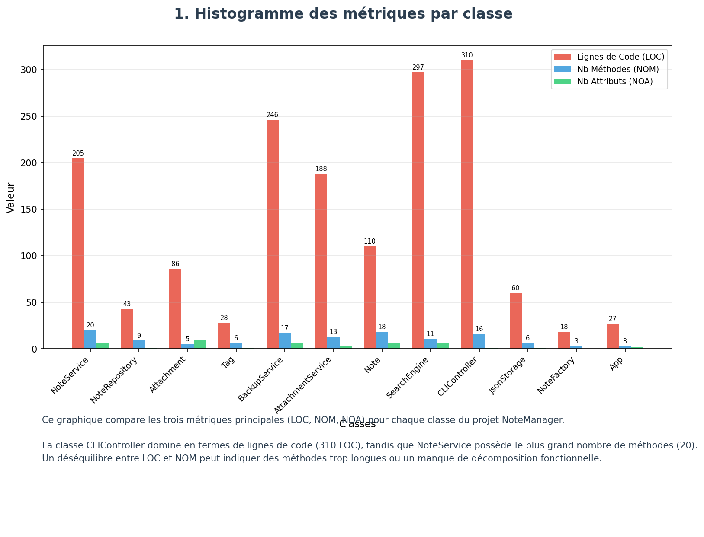
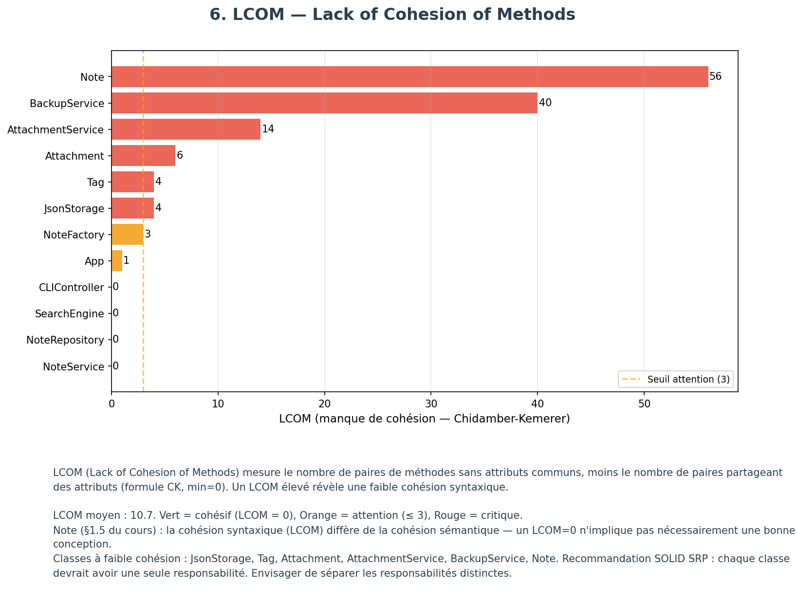

# Rapport TP2 — Évaluer la qualité d'un projet TypeScript

**Cours** : MGL843 — Sujets avancés en conception logicielle  
**Projet** : NoteManager (TypeScript / Node.js)  
**Dépôt** : [MehdiAq/TP2-NoteManager](https://github.com/MehdiAq/TP2-NoteManager)  
**Équipe** : 2

---

## Table des matières

- [Rapport TP2 — Évaluer la qualité d'un projet TypeScript](#rapport-tp2--évaluer-la-qualité-dun-projet-typescript)
  - [Table des matières](#table-des-matières)
  - [Partie 1: Ajouter des exigences au projet TypeScript](#partie-1-ajouter-des-exigences-au-projet-typescript)
    - [Question 1 — Exigences ajoutées et justifications](#question-1--exigences-ajoutées-et-justifications)
    - [Question 2 — Impact sur la complexité et la conception](#question-2--impact-sur-la-complexité-et-la-conception)
  - [Partie 2: Visualiser les métriques du projet TypeScript](#partie-2-visualiser-les-métriques-du-projet-typescript)
    - [Question 1 — Métriques choisies](#question-1--métriques-choisies)
    - [Question 2 — Calcul des métriques supplémentaires](#question-2--calcul-des-métriques-supplémentaires)
    - [Question 3 — Éléments remarquables](#question-3--éléments-remarquables)
    - [Question 4 — Rôle des éléments remarquables](#question-4--rôle-des-éléments-remarquables)
    - [Question 5 — Qualité de la conception](#question-5--qualité-de-la-conception)
  - [Annexes](#annexes)
    - [Annexe 1 — Dépôt GitHub du projet TypeScript](#annexe-1--dépôt-github-du-projet-typescript)
    - [Annexe 2 — Code Pharo / Moose (export des métriques)](#annexe-2--code-pharo--moose-export-des-métriques)
    - [Annexe 3 — Détail des exigences FURPS](#annexe-3--détail-des-exigences-furps)
    - [Annexe 4 — Figures](#annexe-4--figures)
      - [Figure 1](#figure-1)
      - [Figure 2](#figure-2)
      - [Figure 3](#figure-3)
      - [Figure 4](#figure-4)
      - [Figure 5](#figure-5)
      - [Figure 6](#figure-6)
      - [Figure 7](#figure-7)
      - [Figure 8](#figure-8)
      - [Figure 9](#figure-9)
      - [Figure 10](#figure-10)

---

## Partie 1: Ajouter des exigences au projet TypeScript

### Question 1 — Exigences ajoutées et justifications

Trois nouvelles exigences FURPS ont été ajoutées au projet NoteManager :

**1. Fiabilité (Reliability) — Système de Backup Automatique**

Le système persiste les notes dans un fichier JSON local. Une corruption ou perte de ce fichier entraînerait la perte totale des données. Un mécanisme de backup automatique avec vérification d'intégrité SHA-256 répond à ce risque. Validé par 22 tests incluant l'injection d'erreurs (corruption, permissions, JSON invalide), conformément à la définition FURPS de la fiabilité qui exige une validation par introduction d'erreurs.

**2. Fonctionnalité (Functionality) — Support des Pièces Jointes**

La gestion de notes en texte seul est limitante. Associer des fichiers (PDF, images, code) aux notes enrichit le domaine fonctionnel et augmente la complexité structurelle du projet (nouvelles classes, interfaces, modèle). Validé par 38 tests couvrant le CRUD complet et la persistance.

**3. Performance — Recherche Optimisée (< 100ms pour 1000 notes)**

Sans optimisation, la recherche linéaire O(n) devient un goulot d'étranglement avec le volume de notes. L'ajout d'un index inversé et d'un cache LRU garantit une performance mesurable objectivement. Validé par 21 tests : résultat de 0.28ms pour 1000 notes (objectif < 100ms).

### Question 2 — Impact sur la complexité et la conception

Au TP1, le projet NoteManager avait une conception linéaire : une entité (`Note`), un service (`NoteService`), un contrôleur (`CLIController`) et des utilitaires (`NoteFactory`, `Tag`, `App`). Le flux était simple : CLI → Service → Persistance JSON. Le rapport TP1 identifiait déjà des problèmes de cohésion dans `CLIController` (135 LOC, 9 méthodes) et une entité `Note` surchargée (18 méthodes, 6 attributs).

**Les trois exigences du TP2 augmentent la complexité sur deux axes :**

**1. Complexité structurelle** — Le projet passe de 15 à 24 fichiers sources, de ~800 à ~2500 LOC et de 39 à 120 tests. Cinq nouvelles classes/interfaces apparaissent (`BackupService`, `AttachmentService`, `Attachment`, `IBackupService`, `IAttachmentService`), augmentant le nombre d'entités dans le modèle Famix et les interactions entre elles.

| Métrique | TP1 | TP2 | Augmentation |
|----------|-----|-----|--------------|
| Fichiers sources | 15 | 24 | +60% |
| Lignes de code | ~800 | ~2500 | +210% |
| Tests | 39 | 120 | +208% |

**2. Complexité de conception** — Par rapport au flux linéaire du TP1, le `NoteService` devient un orchestrateur de trois sous-systèmes (backup, attachements, recherche), ce qui augmente son couplage (CBO). Chaque exigence introduit une complexité propre absente au TP1 :

- **Backup** : gestion d'intégrité (SHA-256), politique de rétention et restauration — des responsabilités transversales inexistantes dans le TP1.
- **Pièces jointes** : nouveau modèle de données (`Attachment`) avec son propre cycle de vie et sa persistance séparée, là où le TP1 ne gérait qu'une seule entité (`Note`).
- **Recherche optimisée** : remplacement de la recherche linéaire du TP1 par des structures de données avancées (index inversé, HashMap, cache LRU), augmentant la complexité cyclomatique du `SearchEngine`.

Cependant, l'utilisation d'interfaces (`IBackupService`, `IAttachmentService`) et de l'injection de dépendances limite la propagation du couplage, contrairement au TP1 où le `CLIController` concentrait toute la logique.

---

## Partie 2: Visualiser les métriques du projet TypeScript

### Question 1 — Métriques choisies

Nous avons retenu les métriques de Chidamber et Kemerer (1994) pour évaluer la qualité de la conception, accompagnées de métriques de taille. Ce choix s'appuie sur les études empiriques couvertes dans le cours : Basili, Briand et Melo (1996) ont démontré que cinq des six métriques CK sont utiles pour prédire la prédisposition des fautes, et la revue systématique d'Isong et Obeten (2013) portant sur 29 études confirme que CBO, WMC et LOC sont parmi les métriques les moins controversées à cet effet.

| Métrique | Définition | Pourquoi elle est importante |
|----------|-----------|------------------------------|
| **LOC** (Lines of Code) | Nombre de lignes de code source par classe | Meilleure métrique individuelle pour prédire où se trouveront les fautes : plus il y a de code, plus la probabilité d'erreur est grande. Dans notre contexte de « vibe coding » sans refactoring, LOC est particulièrement révélatrice car l'IA génère du code sans souci d'optimisation de la taille. |
| **NOM** (Number of Methods) | Nombre de méthodes d'une classe | Indique la taille fonctionnelle d'une classe. Un NOM élevé peut signaler une classe qui concentre trop de responsabilités, en violation du principe de responsabilité unique (SRP). |
| **NOA** (Number of Attributes) | Nombre d'attributs d'une classe | Mesure la quantité d'état interne d'une classe. Combiné avec NOM, il permet de détecter des classes surchargées (beaucoup de méthodes et d'attributs) ou des « data classes » (beaucoup d'attributs, peu de méthodes). |
| **WMC** (Weighted Methods per Class) | Somme des complexités cyclomatiques de chaque méthode (Chidamber et Kemerer, 1994) | Deuxième meilleure métrique pour prédire les fautes après LOC. Un WMC élevé indique une classe complexe et difficile à tester. Isong et Obeten (2013) confirment que WMC est parmi les métriques les moins controversées, avec 21 études la jugeant significative sur 29. Seuils : vert ≤ 10, orange ≤ 20, rouge > 20. |
| **DIT** (Depth of Inheritance Tree) | Profondeur maximale dans la hiérarchie d'héritage (Chidamber et Kemerer, 1994) | Un DIT élevé augmente la complexité car la classe hérite de nombreux comportements, la rendant plus difficile à comprendre et à modifier. Dans un projet TypeScript généré par IA, on s'attend à un DIT faible car le vibe coding favorise généralement la composition plutôt que l'héritage. Seuils : vert ≤ 2, orange ≤ 4, rouge > 4. |
| **CBO** (Coupling Between Objects) | Nombre de classes distinctes auxquelles une classe est couplée, toutes directions confondues (Chidamber et Kemerer, 1994) | Métrique jugée significative dans le plus grand nombre d'études empiriques (23 sur 29). Un CBO élevé fragilise la maintenabilité car une modification dans une classe couplée peut avoir un effet en cascade (heuristique GRASP Faible Couplage). Seuils : vert ≤ 4, orange ≤ 8, rouge > 8. |
| **LCOM** (Lack of Cohesion of Methods) | Nombre de paires de méthodes sans attributs communs moins le nombre de paires partageant des attributs, formule CK : max(0, \|P\| − \|Q\|) (Chidamber et Kemerer, 1994) | Un LCOM élevé suggère que la classe regroupe des responsabilités indépendantes qui pourraient être séparées. Il faut cependant nuancer : LCOM mesure la cohésion syntaxique (partage d'attributs entre méthodes), qui diffère de la cohésion sémantique. Un LCOM de 0 n'implique pas nécessairement une bonne conception, et des méthodes accesseurs peuvent gonfler artificiellement le LCOM. Seuils : vert = 0, orange ≤ 3, rouge > 3. |

### Question 2 — Calcul des métriques supplémentaires

Certaines métriques CK ne sont pas directement disponibles via l'API native de FamixTypeScript dans Moose. Il a donc fallu écrire du code Pharo supplémentaire dans le script `pharo-metrics-export.st` pour les calculer.

**WMC** a été calculé en sommant la complexité cyclomatique (`cyclomaticComplexity`, disponible sur chaque méthode via le trait `TMethod`) pour toutes les méthodes de la classe. Si la CC d'une méthode est indisponible, on lui attribue CC = 1, soit le minimum théorique pour une méthode sans point de décision.

**DIT** a été calculé en parcourant itérativement la chaîne `superclass` depuis la classe jusqu'à la racine de la hiérarchie, en incrémentant un compteur à chaque niveau.

**CBO** a été calculé par parcours bidirectionnel des dépendances : pour chaque méthode de la classe, on collecte les classes distinctes couplées via les invocations sortantes, les invocations entrantes, et les accès aux attributs d'autres classes. Le CBO est le nombre total de classes couplées distinctes.

Deux métriques dérivées ont également été calculées dans le script de visualisation (`generate_charts.py`) pour affiner l'analyse :

- **LOC/M** (LOC par méthode) : ratio LOC ÷ NOM. Permet de distinguer les classes volumineuses à cause de nombreuses méthodes courtes de celles ayant des méthodes anormalement longues.
- **CC/M** (CC moyenne par méthode) : ratio WMC ÷ NOM. Permet de distinguer un WMC élevé dû à un grand nombre de méthodes simples d'un WMC élevé dû à des méthodes individuellement complexes.

### Question 3 — Éléments remarquables

Les éléments remarquables ont été identifiés en croisant les visualisations générées par le pipeline CI ([Figure 1](#figure-1)). Chaque graphique met en évidence un aspect différent de la qualité, et les classes qui apparaissent en zone rouge ou orange sur plusieurs graphiques simultanément sont les plus préoccupantes.

**CLIController** est la classe la plus volumineuse du projet (310 LOC, 16 méthodes). Le graphique WMC ([Figure 5](#figure-5)) la place en tête avec un WMC de 44, bien au-delà du seuil critique de 20. La densité LOC/méthode ([Figure 4](#figure-4)) confirme avec un ratio de 19.4 LOC/M, indiquant des méthodes longues. Le graphique CBO ([Figure 6](#figure-6)) montre un couplage de 6, en zone orange. Malgré cela, son LCOM est de 0 ([Figure 7](#figure-7)) car elle ne possède qu'un seul attribut, ce qui limite le diagnostic de cohésion par cette métrique.

**NoteService** est la classe ayant le plus grand nombre de méthodes (20) et le CBO le plus élevé du projet (9), seule classe en zone rouge sur le graphique CBO ([Figure 6](#figure-6)). Son WMC de 33 dépasse le seuil critique ([Figure 5](#figure-5)). Le diagramme de dispersion ([Figure 3](#figure-3)) la positionne en dessous de la ligne moyenne LOC/méthode, ce qui indique des méthodes relativement concises malgré leur nombre élevé.

**Note** est le modèle de données central du projet (18 méthodes, 6 attributs). Elle présente le LCOM le plus élevé du projet (56), très au-delà du seuil d'attention de 3 ([Figure 7](#figure-7)). Cela signifie que la majorité de ses paires de méthodes n'accèdent à aucun attribut commun. Son CBO de 6 ([Figure 6](#figure-6)) la place en zone orange.

**BackupService** et **AttachmentService** sont les deux classes ajoutées pour les exigences FURPS du TP2. BackupService a le deuxième WMC le plus élevé (36) ([Figure 5](#figure-5)) et un LCOM de 40 ([Figure 7](#figure-7)). AttachmentService affiche un WMC de 26 et un LCOM de 14. Ces valeurs élevées s'expliquent par la complexité des fonctionnalités de fiabilité (backup avec vérification SHA-256) et de gestion des pièces jointes (14 types MIME).

**SearchEngine** se distingue par le ratio LOC/méthode le plus élevé du projet (27.0), presque 3 fois le seuil recommandé de 10 ([Figure 4](#figure-4)). Avec 297 LOC pour seulement 11 méthodes, ses méthodes sont en moyenne très longues, ce qui complique la lisibilité et les tests. Son WMC de 33 et sa CC/M de 3.0 ([Figure 5](#figure-5)) confirment que ses méthodes contiennent une logique complexe (index inversé, cache LRU).

Le graphique radar ([Figure 9](#figure-9)) superpose les métriques normalisées pour les trois classes les plus remarquables (NoteService, Note, CLIController), permettant de visualiser rapidement leur profil de risque multi-dimensionnel.

**Classes aux métriques les plus basses :** À l'opposé, Tag (28 LOC, WMC=7), NoteFactory (18 LOC, WMC=3) et NoteRepository (43 LOC, WMC=10) restent en zone verte sur tous les graphiques ([Figure 1](#figure-1)).

### Question 4 — Rôle des éléments remarquables

**CLIController** est le point d'entrée utilisateur du projet. Il reçoit les commandes CLI (créer, lister, chercher, supprimer, backup, restaurer, attacher) et les délègue aux services appropriés. Son importance est critique car il orchestre toutes les interactions entre l'utilisateur et le système. Son WMC élevé (44) s'explique par le fait qu'il contient la logique de routage, de parsing des arguments et de formatage des sorties pour chaque commande.

**NoteService** est le service central de la couche métier. Il coordonne la gestion des notes en orchestrant les interactions entre NoteRepository (persistance), BackupService (fiabilité), AttachmentService (pièces jointes) et SearchEngine (recherche). Son CBO de 9 (le plus élevé du projet) reflète directement ce rôle de médiateur : il dépend de 9 autres classes. C'est la classe la plus critique en termes de maintenabilité car tout changement dans l'un des sous-systèmes peut l'impacter.

**Note** est l'entité du domaine. Elle encapsule les données d'une note (titre, contenu, tags, date, pièces jointes) et les comportements associés (ajout/suppression de tags, gestion des pièces jointes, sérialisation JSON). Son LCOM de 56 s'explique par le fait qu'elle regroupe des méthodes opérant sur des sous-ensembles d'attributs distincts : les méthodes de tags n'accèdent pas aux mêmes attributs que les méthodes de pièces jointes, ce qui crée des paires de méthodes sans attribut commun.

**BackupService** implémente l'exigence de fiabilité du TP2. Il gère la création de backups automatiques avec vérification d'intégrité SHA-256, la politique de rétention (nombre maximal de backups) et la restauration. Son WMC de 36 et son LCOM de 40 reflètent la diversité de ses responsabilités : hashing, gestion de fichiers, validation d'intégrité, rotation des backups.

**AttachmentService** implémente l'exigence de fonctionnalité du TP2. Il gère le cycle de vie des pièces jointes (ajout, suppression, validation MIME pour 14 types de fichiers, persistance). Son WMC de 26 et son LCOM de 14 s'expliquent par la combinaison de validation, de gestion de fichiers et de persistance.

**SearchEngine** implémente l'exigence de performance du TP2. Il maintient un index inversé et un cache LRU pour garantir une recherche en moins de 100ms sur 1000 notes. Son LOC/M de 27.0 (le plus élevé du projet) s'explique par la complexité algorithmique de l'indexation et de la recherche full-text, qui nécessitent des méthodes longues manipulant des structures de données imbriquées (HashMap, listes inversées).

### Question 5 — Qualité de la conception

Le projet NoteManager totalise 1618 LOC réparties dans 12 classes et 127 méthodes. L'analyse des métriques CK révèle une conception avec des points forts notables mais aussi plusieurs éléments qui mériteraient un refactoring ([Figure 10](#figure-10)).

**Points forts de la conception :**

Le DIT moyen de 0.6 ([Figure 8](#figure-8)) indique que le projet favorise la composition plutôt que l'héritage, ce qui est conforme à l'heuristique recommandée dans le cours. Aucune classe ne dépasse un DIT de 1. Le CBO moyen de 3.7 reste sous le seuil d'attention de 4, ce qui témoigne d'un couplage globalement maîtrisé (principe GRASP Faible Couplage). Les classes Tag, NoteFactory et NoteRepository restent en zone verte sur l'ensemble des métriques — elles sont petites, peu couplées et faciles à maintenir, ce qui démontre qu'une bonne conception est possible dans le projet.

**Éléments mal conçus :**

**CLIController** est un exemple typique du « God Class » anti-pattern. Avec un WMC de 44 et 310 LOC, il concentre la logique de routage, de parsing et de formatage pour toutes les commandes. Un refactoring selon le patron Commande (GoF) permettrait de distribuer chaque commande CLI dans sa propre classe, réduisant le WMC et améliorant la testabilité. Alternativement, le principe GRASP Forte Cohésion recommanderait de séparer le parsing des arguments de la logique métier.

**NoteService** souffre d'un couplage excessif (CBO=9, seule classe en zone rouge sur le graphique CBO, [Figure 6](#figure-6)). Son rôle de médiateur entre 4 sous-systèmes en fait un point de fragilité : tout changement dans BackupService, AttachmentService, SearchEngine ou NoteRepository l'impacte. L'application du principe d'inversion des dépendances (DIP) via des interfaces et du patron Façade pourrait réduire les dépendances directes.

**Note** présente le LCOM le plus élevé du projet (56). Cependant, il faut nuancer ce résultat : la cohésion syntaxique mesurée par LCOM diffère de la cohésion sémantique. Les méthodes de Note opèrent sur des sous-ensembles d'attributs distincts (tags, pièces jointes, métadonnées) mais restent sémantiquement cohérentes autour du concept de « note ». C'est un cas où le LCOM élevé ne signifie pas nécessairement une mauvaise conception, mais plutôt un modèle de domaine riche. Néanmoins, on pourrait envisager d'extraire la gestion des pièces jointes dans une classe séparée pour améliorer la cohésion syntaxique.

**BackupService** (LCOM=40) et **AttachmentService** (LCOM=14) concentrent des responsabilités fonctionnellement liées mais syntaxiquement indépendantes. Pour BackupService, les méthodes de hashing n'accèdent pas aux mêmes attributs que les méthodes de rotation des backups, ce qui gonfle le LCOM. Ces classes pourraient bénéficier d'une décomposition selon le principe de responsabilité unique (SRP SOLID) : par exemple, séparer la logique de hashing de la logique de gestion de fichiers.

**SearchEngine** a le ratio LOC/méthode le plus élevé du projet (27.0, [Figure 4](#figure-4)). Ses méthodes longues et complexes (CC/M=3.0) rendent la classe difficile à tester unitairement. Une décomposition en sous-méthodes plus courtes améliorerait la lisibilité sans changer le comportement.

**Impact du vibe coding sur la qualité :**

Le WMC moyen du projet (20.0) se situe exactement au seuil critique, avec 6 classes sur 12 en zone rouge. Cela reflète une caractéristique du vibe coding : l'IA génère du code fonctionnel mais ne refactorise pas spontanément. Les classes générées pour les exigences FURPS (BackupService, AttachmentService, SearchEngine) sont toutes en zone rouge pour le WMC, ce qui suggère que l'ajout de fonctionnalités par vibe coding accumule de la dette technique sans mécanisme de simplification.

---

## Annexes

### Annexe 1 — Dépôt GitHub du projet TypeScript
https://github.com/MehdiAq/TP2-NoteManager

### Annexe 2 — Code Pharo / Moose (export des métriques)
Le script Smalltalk utilisé pour exporter les métriques depuis Moose se trouve dans le même dépôt, dans le fichier [`ci/pharo-metrics-export.st`](https://github.com/MehdiAq/TP2-NoteManager/blob/main/ci/pharo-metrics-export.st). Ce script charge le modèle FamixTypeScript généré par ts2famix, calcule 7 métriques par classe (NOM, NOA, LOC, WMC, DIT, CBO, LCOM) et exporte les résultats en CSV via NeoCSV. Il est exécuté automatiquement par le pipeline CI/CD GitHub Actions.

### Annexe 3 — Détail des exigences FURPS
Voir le fichier [`Note-de-changement-FURPS.md`](../Note-de-changement-FURPS.md) pour la documentation complète des 3 exigences implémentées (architecture, utilisation, résultats de tests).

### Annexe 4 — Figures

#### Figure 1
**Tableau récapitulatif des métriques**

#### Figure 2
**Histogramme des métriques par classe (LOC, NOM, NOA)**

#### Figure 3
**Diagramme de dispersion — LOC vs NOM**

#### Figure 4
**Densité de code par classe (LOC / méthode)**

#### Figure 5
**WMC — Weighted Methods per Class**

#### Figure 6
**CBO — Coupling Between Objects**

#### Figure 7
**LCOM — Lack of Cohesion of Methods**

#### Figure 8
**DIT — Depth of Inheritance Tree**

#### Figure 9
**Radar — Vue multi-métriques des classes remarquables**

#### Figure 10
**Conclusion et recommandations**

---

*Ce rapport a été rédigé avec l'aide du LLM Claude Opus 4.6.*